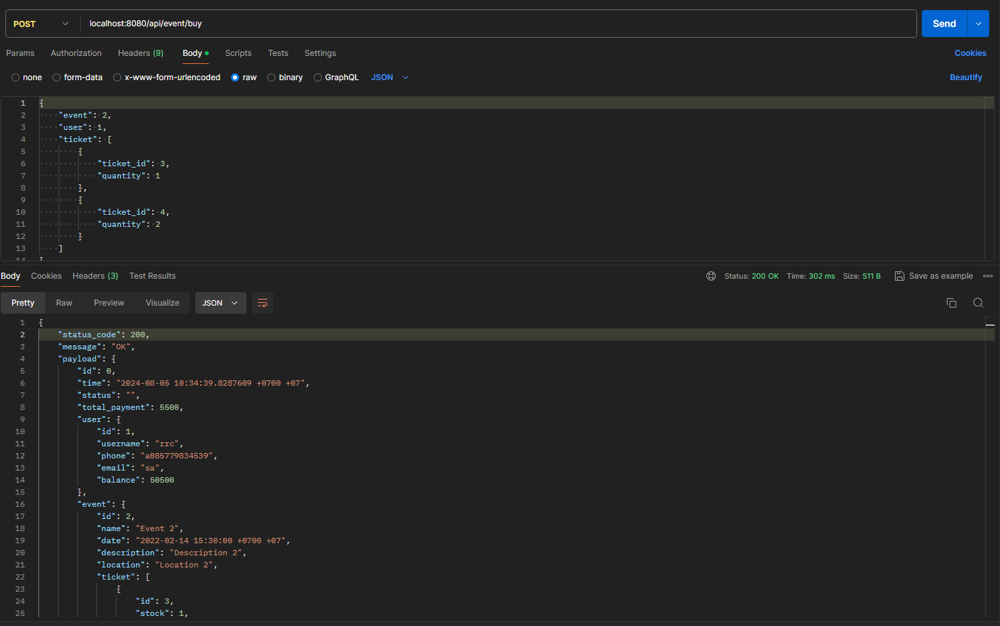
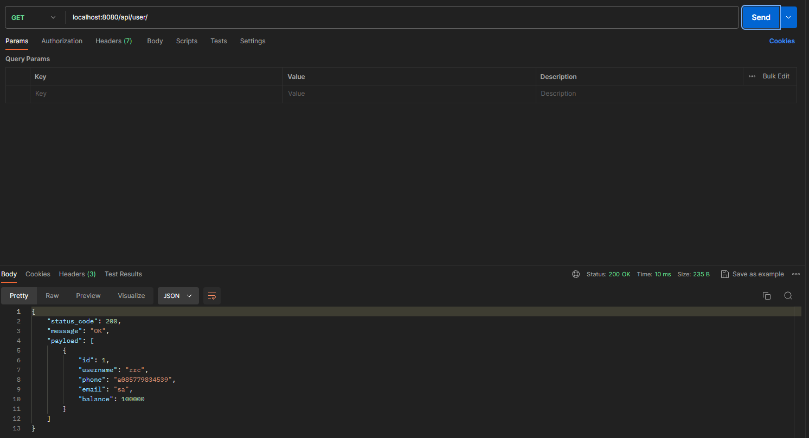
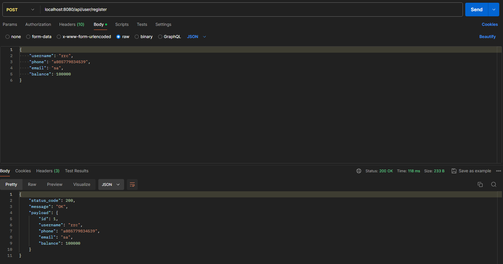
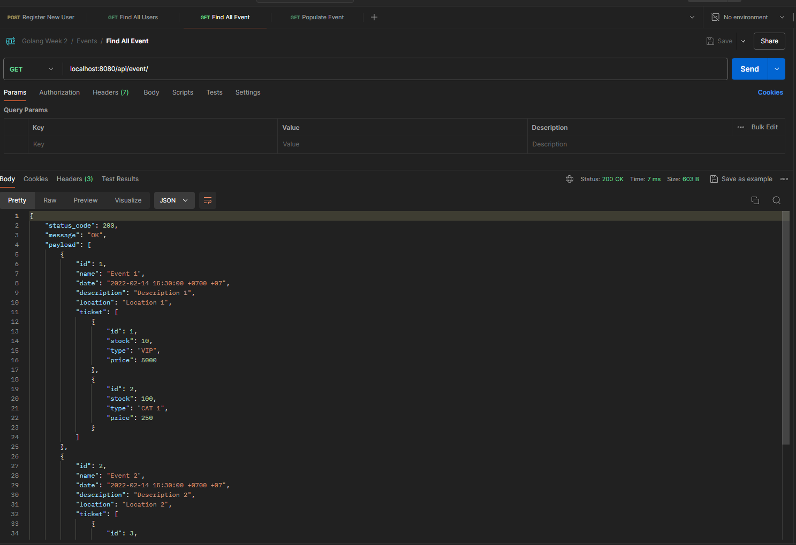
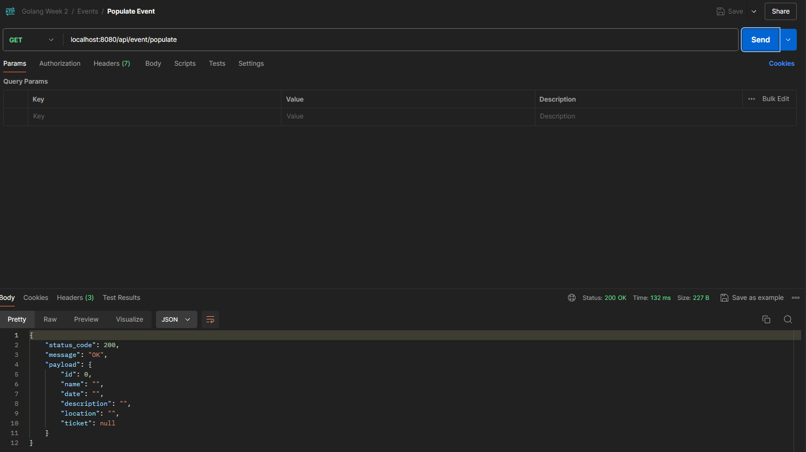
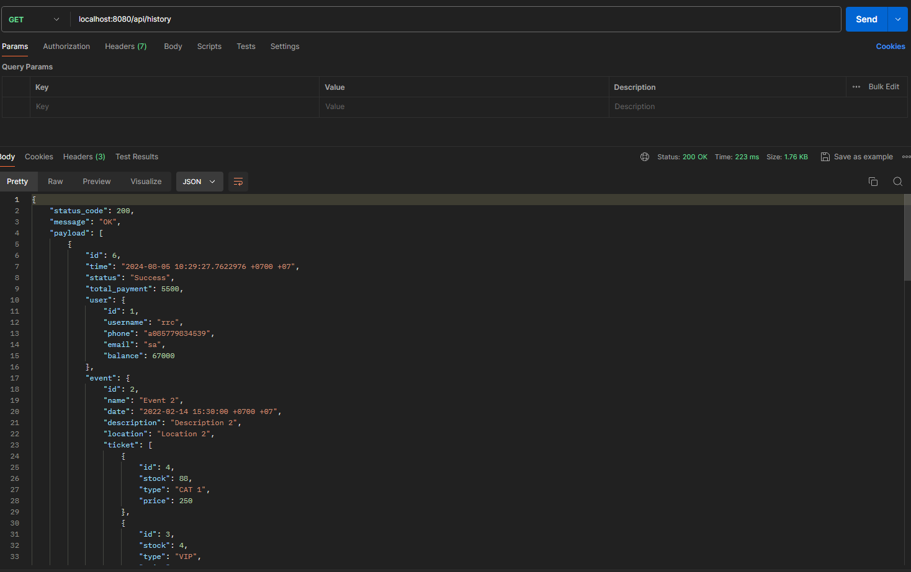

# bootcamp-go-week2-ticket

Week 2 Test - ticketing

## Buy Ticket Request

## User Endpoint

### List User - /api/user/

### Register User - /api/user/register

## Event Endpoint

### List Event - /api/event/

### Populate Hardcoded Event - /api/event/populate

### Buy Event Ticket(s) - /api/event/buy

## Transaction Detail Endpoint

### Transaction Detail List Success with details - /api/history

### Transaction Detail - /api/history/all
